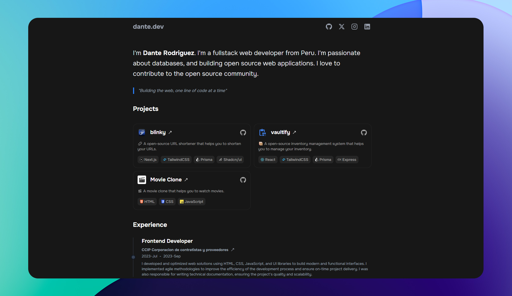

<div align="center">
  <a href="https://dani-dev-neon.vercel.app/">
    
  </a>
</div>

<div align="center">
    <a href="https://dani-dev-neon.vercel.app/" target="_blank">
        🌐 Live Demo
    </a>
    &nbsp;|&nbsp;
    <a href="#-features">
        ✨ Features
    </a>
    &nbsp;|&nbsp;
    <a href="#-stack">
        🛠️ Tech Stack
    </a>
</div>

<div align="center">
  <br/>
  
  
  
  
  
  
</div>

## 📦 Stack

- [**React 19**](https://reactjs.org/) - JavaScript library
- [**TypeScript**](https://www.typescriptlang.org/) - JavaScript with syntax for types
- [**Tailwind CSS**](https://tailwindcss.com/) - CSS framework
- [**Lucide Icons**](https://lucide.dev/) - Icon library
- [**Vercel**](https://vercel.com) - Deployment platform
- [**Prettier**](https://prettier.io/) + [prettier-plugin-tailwindcss](https://github.com/tailwindlabs/prettier-plugin-tailwindcss) - An opinionated code formatter.
- [**Lucide Icons**](https://lucide.dev/) + [**svgl**](https://svgl.app/) - Beautifully SVGs icons & logos.

## 📄 Dependencies

1. Install dependencies:

```bash
# Install pnpm globally if you don't have it:
npm install -g pnpm

# and install dependencies:
pnpm install
```

2. Run the development server:

```bash
pnpm dev
```

Open up [http://localhost:5173](http://localhost:5173) and make your changes ✨.
